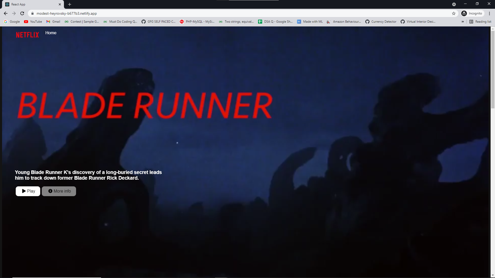

# Netflix Clone using Astra DB and GraphQL

A simple **ReactJS** Netflix homepage clone running on Astra DB that leverages a GraphQL API with paging and infinite scrolling.

<!--- ENDEXCLUDE --->
- [Live Demo](https://workshop-graphql-netflix.netlify.app/)

## Objectives
* Deploy a Netflix clone to production
* Learn **GraphQL API** and how to use it with a database to create the tables and navigate the data.
* Learn about **paging** and **infinite scrolling** in web ui
* Leverage Netlify and DataStax Astra DB

## Table of contents

###  DB Setup & Data Ingest
1. [Create Astra DB Instance](#1-login-or-register-to-astradb-and-create-database)
2. [Create a security token](#2-create-a-security-token)
3. [Create table **genre** with GraphQL](#3-create-table-genre-with-graphql)
4. [Insert data in **genre**  with GraphQL](#4-insert-data-in-the-table-with-graphql)
5. [Retrieve values of **genre** table](#5-retrieving-list-of-values)
6. [Create **movie** table](#6-creating-a-movies-table)
7. [Insert values in **movie** table](#7-insert-values-in-movie-table)
8. [Retrieve values from **movie** table](#8-retrieve-values-from-movie-tables)
9. [Load a CSV DataSet](#9-load-a-csv-dataset)

###  Deploy to Production
1. [Deploy to Netlify](#1-deploy-to-netlify)
2. [Clone your GitHub repository](#2-clone-your-github-repository)
3. [Launch GitPod](#3-launch-gitpod-ide)
4. [Install the Netlify CLI](#4-install-the-netlify-cli-command-line-interface)
5. [Retrieve application token to securely connect to the database](#5-generate-application-token-to-securely-connect-to-the-database)
6. [Configure Environment Variables and Install Dependencies](#6-configure-and-connect-database)
7. [Launch your app](#7-launch-your-app)
8. [Connect Netlify to your site](#8-connect-netlify-to-your-site)
9. [Deploy to production](#9-deploy-to-production)

